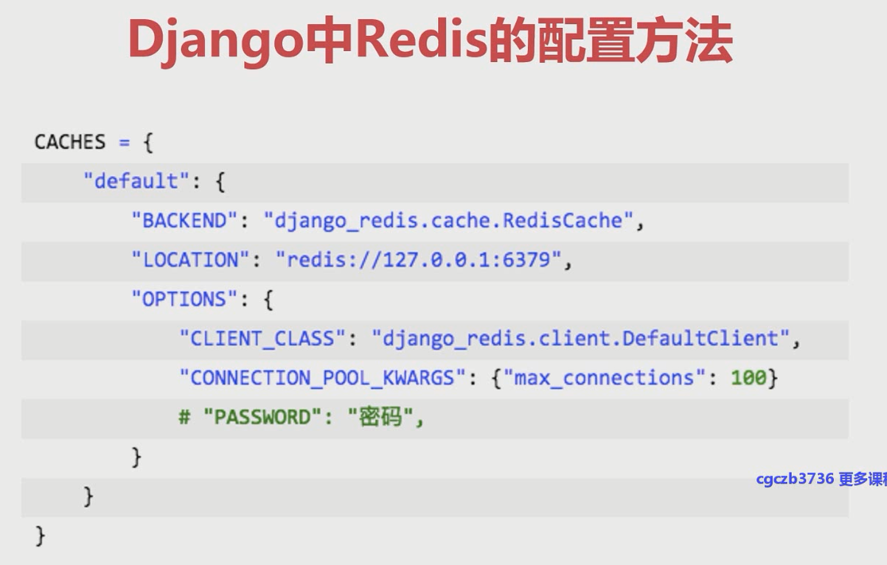
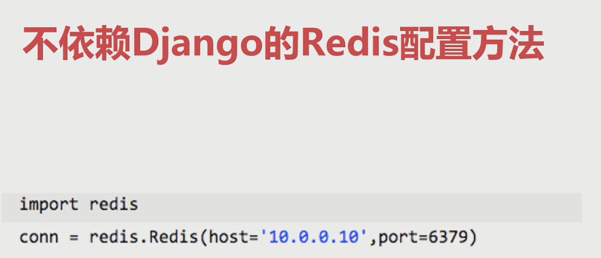

#### Djanog整合redis
##### 什么是redis
    1.Redis是一个基于内存的非关系型数据库。它通过key：value的形式存储。有着多种数据结构，如字符串，列表，集合等
    2.通过redis我们可以进行数据缓存，防止底层数据库频繁io，提升性能
##### redis的依赖
    1.pip install redis
    2.pip install django-redis
##### django中redis的配置方法

##### 不依赖django的redis配置方法

##### Django中使用redis的方法
```python
```
